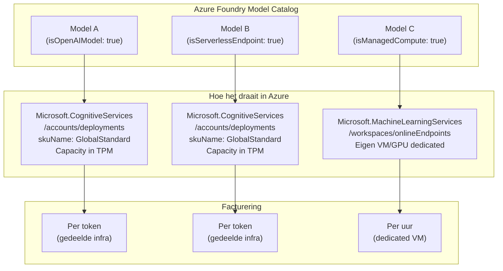
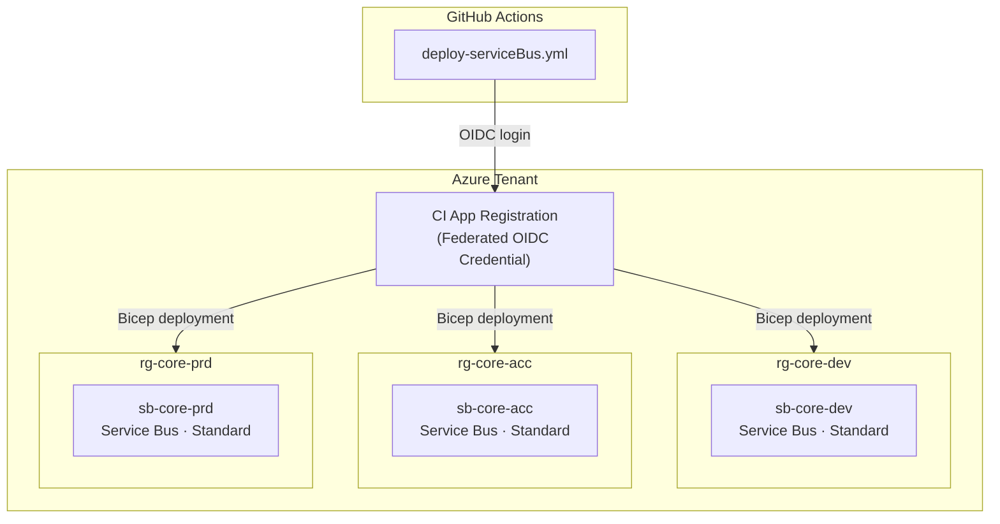
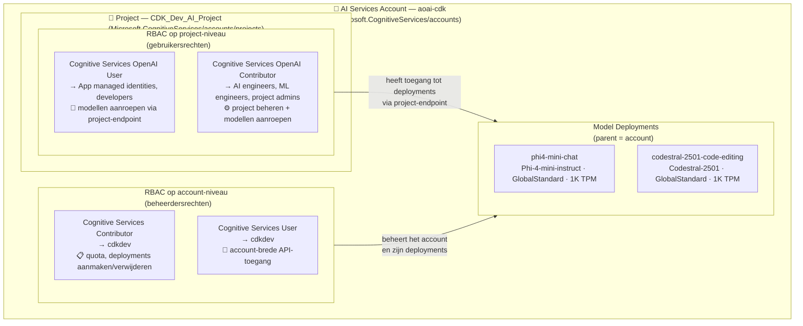
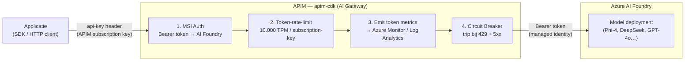

# azure-cdk-infra

Core Azure infrastructure repository. Manages shared Azure resources via Bicep and GitHub Actions CI/CD across three environments: **dev**, **acc**, and **prd**.

## Foundry Models sold by Azure

> Source: [Foundry Models sold by Azure — Microsoft Learn](https://learn.microsoft.com/en-gb/azure/foundry/foundry-models/concepts/models-sold-directly-by-azure?pivots=azure-openai)

Foundry Models sold by Azure are hosted and operated by Azure as part of the Foundry Models service, covering all Azure OpenAI models as well as selected models from third-party providers such as DeepSeek, Meta, Mistral, Cohere, and xAI. These models are billed through your Azure subscription, backed by Azure SLAs, and supported by Microsoft. Model availability varies by region — for European deployments, `swedencentral` offers the broadest coverage.

## Model Deployment Types

De **catalog type** geeft aan hoe een model wordt gehost en gefactureerd in Azure. Er zijn drie smaken:



| | **OpenAI** | **Serverless** | **ManagedCompute** |
|---|---|---|---|
| **Wat is het** | Azure's eigen OpenAI-modellen (GPT, o-serie, etc.) | Derde partij modellen van bijv. DeepSeek, Anthropic, Phi-4 | Open-source modellen op een dedicated VM/GPU |
| **Bicep resource** | `CognitiveServices/accounts/deployments` | `CognitiveServices/accounts/deployments` | `MachineLearningServices/workspaces/onlineEndpoints` |
| **`skuName`** | `GlobalStandard`, `ProvisionedManaged`, etc. | `GlobalStandard` | n.v.t. — VM-grootte kies je |
| **Facturering** | Per token | Per token | Per uur (VM draait altijd) |
| **Cold start** | Geen | Geen | Mogelijk (VM moet opstarten) |
| **Voorbeeldmodellen** | `gpt-4o`, `o3`, `gpt-5` | `Phi-4-mini-instruct`, `DeepSeek-V4-Flash` | Hugging Face modellen |

> **OpenAI** en **Serverless** werken allebei via dezelfde Bicep resource (`CognitiveServices/accounts/deployments`) met `skuName: GlobalStandard` — de huidige code dekt dus beide. Alleen voor **ManagedCompute** (Hugging Face) is een aparte Bicep module nodig.

## Available AI Model Deployments

> **Source of truth:** the Azure Foundry MCP server (`model_catalog_list`, region `westeurope`, subscription `sub-cdk`).  
> Before adding or changing a deployment in `infra/parameters/parameters.json`, verify the `modelName` exists in the table below and use the exact casing shown.

### Deployment format in `parameters.json`

```json
{
    "deploymentName": "phi4-mini-chat",
    "modelName": "Phi-4-mini-instruct",
    "modelVersion": "1",
    "modelFormat": "Microsoft",
    "skuName": "GlobalStandard",
    "capacity": 1
}
```

```json
{
    "deploymentName": "codestral-2501-code-editing",
    "modelName": "Codestral-2501",
    "modelVersion": "2",
    "modelFormat": "Mistral AI",
    "skuName": "GlobalStandard",
    "capacity": 1
}
```

> `modelFormat` = publisher name from the catalog. `skuName` controls the deployment type (see table below). `modelVersion` must be verified in the Azure portal per model. `capacity` = TPM × 1,000.

### `skuName` values

| `skuName` | Deployment type | Use for |
|---|---|---|
| `GlobalStandard` | Pay-per-token, global routing | OpenAI models + Serverless third-party (DeepSeek, Phi-4, Anthropic…) |
| `Standard` | Pay-per-token, regional | OpenAI models, data-residency required |
| `DataZoneStandard` | Pay-per-token, data zone | EU data boundary |
| `GlobalProvisionedManaged` | PTU — reserved throughput, global | High-volume, latency-sensitive OpenAI |
| `ProvisionedManaged` | PTU — reserved throughput, regional | High-volume + data residency |

### Validation status of current deployments

| deploymentName | modelName | In catalog (westeurope) |
|---|---|---|
| `phi4-mini-chat` | `Phi-4-mini-instruct` | ✅ |
| `codestral-2501-code-editing` | `Codestral-2501` | ❌ not available — replace with a listed model |

### Catalog — deployable models per publisher (westeurope, 2026-08-05)

| Publisher | Model | Deploy type | Max TPM (sub-cdk) |
|---|---|---|---|
| **Anthropic** | `claude-opus-5`, `claude-sonnet-5`, `claude-mythos-5`, `claude-fable-5`, `claude-opus-4-8/7/6/5/1`, `claude-sonnet-4-6/5`, `claude-haiku-4-5` | Serverless | — |
| **Black Forest Labs** | `Flux.1-Kontext-pro`, `Flux-1.1-Pro` | Serverless | — |
| **Cohere** | `Cohere-command-a-plus-05-2026`, `Cohere-rerank-v4.0-pro/fast`, `embed-v-4-0`, `cohere-command-a`, `Cohere-embed-v3-multilingual` | Serverless | — |
| **DeepSeek** | `DeepSeek-V4-Pro`, `DeepSeek-V4-Flash`, `DeepSeek-V3.2`, `DeepSeek-V3.2-Speciale`, `DeepSeek-V3.1`, `DeepSeek-V3-0324`, `DeepSeek-R1-0528`, `DeepSeek-R1` | Serverless | — |
| **Meta** | `Llama-4-Maverick-17B-128E-Instruct-FP8`, `Llama-4-Scout-17B-16E-Instruct`, `Llama-3.3-70B-Instruct` | Serverless | `Llama-4-Scout`: 20k · `Llama-3.3-70B`: 20k |
| **Microsoft** | `Phi-4`, `Phi-4-mini-instruct`, `Phi-4-mini-reasoning`, `Phi-4-multimodal-instruct`, `Phi-4-reasoning`, `MAI-Image-2.5`, `MAI-Image-2.5-Flash`, `MAI-Image-2e`, `MAI-Voice-1/2`, `MAI-Transcribe-1/1.5`, `model-router` | Serverless | `Phi-4`: 20k · `Phi-4-mini-instruct`: 20k · `Phi-4-mini-reasoning`: 20k · `Phi-4-multimodal-instruct`: 20k · `Phi-4-reasoning`: 20k |
| **Mistral AI** | `Mistral-Large-3`, `mistral-medium-2505`, `mistral-small-2503`, `Ministral-3B`, `mistral-document-ai-2512/2505`, `Codestral-2501` | Serverless | `Codestral-2501`: 20k · `mistral-medium-2505`: 20k · `mistral-small-2503`: 20k |
| **Moonshot AI** | `Kimi-K2.7-Code`, `Kimi-K2.6`, `Kimi-K2.5` | Serverless | — |
| **OpenAI** | `gpt-5.6-sol/luna/terra`, `gpt-5.5`, `gpt-5.4/mini/nano/pro`, `gpt-5.3-chat/codex`, `gpt-5.2/chat/codex`, `gpt-5.1/chat/codex/codex-mini/codex-max`, `gpt-5/mini/nano/pro/chat/codex`, `gpt-4.1/mini/nano`, `gpt-4o/mini`, `o1`, `o3/mini/pro`, `o4-mini`, `codex-mini`, `sora-2`, `gpt-image-2`, `gpt-audio/1.5`, `gpt-realtime/2/2.1` | OpenAI | `gpt-5-mini`: 500k · `text-embedding-ada-002`: 240k |
| **StabilityAI** | `Stable-Diffusion-3.5-Large`, `Stable-Image-Ultra`, `Stable-Image-Core` | Serverless | — |
| **xAI** | `grok-4`, `grok-4.3`, `grok-4-20-reasoning/non-reasoning`, `grok-4-1-fast-reasoning/non-reasoning`, `grok-code-fast-1` | Serverless | — |
| **Hugging Face** | `zai-org--glm-5.2-fp8`, `qwen--qwen3.6-27b`, `deepseek-ai--deepseek-v4-flash-0731`, `unsloth--ornith-1.0-35b-gguf--ud-q4_k_xl` | ManagedCompute | — (dedicated VM, no TPM) |

## CI/CD Pipeline

| Trigger | Condition | Job | Environment |
|---|---|---|---|
| `push` | any branch except `main` | `deploy-dev` | dev |
| `pull_request` closed | `merged == true` into `main` | `deploy-acc` | acc |
| after `deploy-acc` succeeds | — | `deploy-prd` | prd |

Each job: creates the resource group if it does not exist → deploys the component Bicep with the matching `.bicepparam`.

## Infrastructure Overview



## Components

### Service Bus (`infra/serviceBus/`)

Azure Service Bus namespace per environment — **Standard tier** (pay-per-use / per operation pricing).

- SAS key authentication is disabled (`disableLocalAuth: true`) — RBAC only
- Role assignments are managed by the consuming project, not this repository

**Outputs**

| Output | Description |
|---|---|
| `serviceBusNamespaceName` | Name of the namespace |
| `serviceBusEndpoint` | Full HTTPS endpoint URL |
| `serviceBusHostname` | Hostname for SDK connections |

## Account, Project en Rollen

Model deployments hangen **altijd aan het account** — niet aan een project. Een project is een logische toegangslaag: het bepaalt via RBAC wie de deployments onder dat account mag gebruiken.



### Waarom deze scheiding?

| Vraag | Antwoord |
|---|---|
| Wie mag deployments aanmaken/verwijderen? | Rollen op **account**-niveau (`Cognitive Services Contributor`) |
| Wie mag modellen aanroepen (applicaties, developers)? | Rollen op **project**-niveau (`Cognitive Services OpenAI User`) |
| Kan een project een deployment verbergen? | Nee — alle deployments onder het account zijn zichtbaar voor iedereen met project-toegang |
| Kan je meerdere projecten maken met elk andere RBAC? | Ja — één account, meerdere projecten, elk met eigen rollenset |

### Bicep resource-hiërarchie

```
Microsoft.CognitiveServices/accounts          (aoai-cdk)
├── /deployments                              (phi4-mini-chat)          ← parent: account
├── /deployments                              (codestral-2501-...)       ← parent: account
└── /projects                                 (CDK_Dev_AI_Project)      ← parent: account
    └── Microsoft.Authorization/roleAssignments  (OpenAI User, OpenAI Contributor)
```

## AI Gateway via APIM

Azure API Management fungeert als **AI Gateway**: één enkel inkomstpunt tussen jouw applicaties en de AI Foundry-modellen. In plaats van elke applicatie direct met de Foundry te laten praten, loopt al het verkeer via APIM — inclusief authenticatie, rate limiting en observability.



### Waarom een AI Gateway?

| Probleem zonder gateway | Oplossing in APIM |
|---|---|
| Elke app beheert eigen API-key | Eén APIM subscription-key per consumer; AI Foundry-keys verdwijnen volledig |
| Geen inzicht in tokenverbruik per app | `azure-openai-emit-token-metric` stuurt gebruik naar Azure Monitor |
| Geen bescherming bij pieken | Token-rate-limit (TPM) per subscription-key voorkomt onverwachte kosten |
| AI Foundry direct bereikbaar van internet | APIM is het enige publieke eindpunt; Foundry kan private zijn |
| Cascade bij throttling | Circuit breaker trip na 3× 429/5xx; herstelt na 60 seconden |

### Componenten in `infra/modules/apim.bicep`

| Component | Resource | Status | Doel |
|---|---|---|---|
| APIM Service | `Microsoft.ApiManagement/service` | ✅ actief | Host van de gateway; system-assigned MSI |
| Diagnostics | `Microsoft.Insights/diagnosticSettings` | ✅ actief | Logs + metrics → Log Analytics |
| Named value | `namedValues/foundry-openai-endpoint` | 💤 commentaar | Foundry endpoint opslaan als variabele |
| Backend + circuit breaker | `service/backends` | 💤 commentaar | Routeert naar Foundry; trip bij 429/5xx |
| API definitie | `service/apis/azure-openai` | 💤 commentaar | OpenAI-compatibel pad (`/openai`) |
| Gateway policy | `service/apis/policies` | 💤 commentaar | MSI-auth + token-limit + metrics |
| RBAC role assignment | `Microsoft.Authorization/roleAssignments` | 💤 commentaar | APIM MSI krijgt *Cognitive Services User* op Foundry account |

> De commentaar-blokken worden geactiveerd zodra `openaiEndpoint` en `openaiAccountName` als parameters worden doorgegeven vanuit `main.bicep`. De parameters staan al klaar in `parameters.json` (`tokenLimitTpmPerSubscription: 10000`).

### Keyless authenticatie

APIM gebruikt een **system-assigned managed identity** — er zijn geen API-keys in de configuratie. De flow:

1. APIM vraagt via MSI een Bearer-token op voor `https://cognitiveservices.azure.com`
2. Het token wordt als `Authorization: Bearer …` header naar AI Foundry gestuurd
3. De APIM MSI heeft de rol **Cognitive Services User** op het Foundry account (role assignment in Bicep)
4. Clients authenticeren alleen tegen APIM via een APIM subscription-key in de `api-key` header

## TPM — Tokens Per Minute

TPM is Azure's rate-limiting unit for AI model deployments. Every request consumes tokens: **input (prompt) + output (completion)** tokens are counted together against the per-minute budget.

### Current limits

| Layer | Setting | Effective TPM |
|---|---|---|
| Model deployment (`deepseek-v4-flash`) | `capacity: 1` | **1,000 TPM** |
| APIM policy (`tokenLimitTpmPerSubscription`) | `10000` | 10,000 TPM per APIM subscription |

The binding constraint is the **model deployment capacity (1,000 TPM)**. The APIM subscriber limit is irrelevant until the deployment capacity is raised.

> **Note:** The `modelDeployments` resource in `infra/modules/openai-project-and-deployments.bicep` is currently commented out, so no model is deployed and the effective TPM is 0.

### How TPM works

```
Each API call:  prompt tokens + completion tokens  →  deducted from per-minute budget
                                                        │
                                              budget exhausted?
                                             /            \
                                           No              Yes
                                           │                │
                                      200 OK           429 Too Many Requests
```

To raise the limit, increase `capacity` in `infra/parameters/parameters.json` under `openaiProject.deployments`. The maximum allowed depends on your subscription's regional quota for the model.

## Resource Groups

| Environment | Resource Group |
|---|---|
| dev | `rg-core-dev` |
| acc | `rg-core-acc` |
| prd | `rg-core-prd` |
